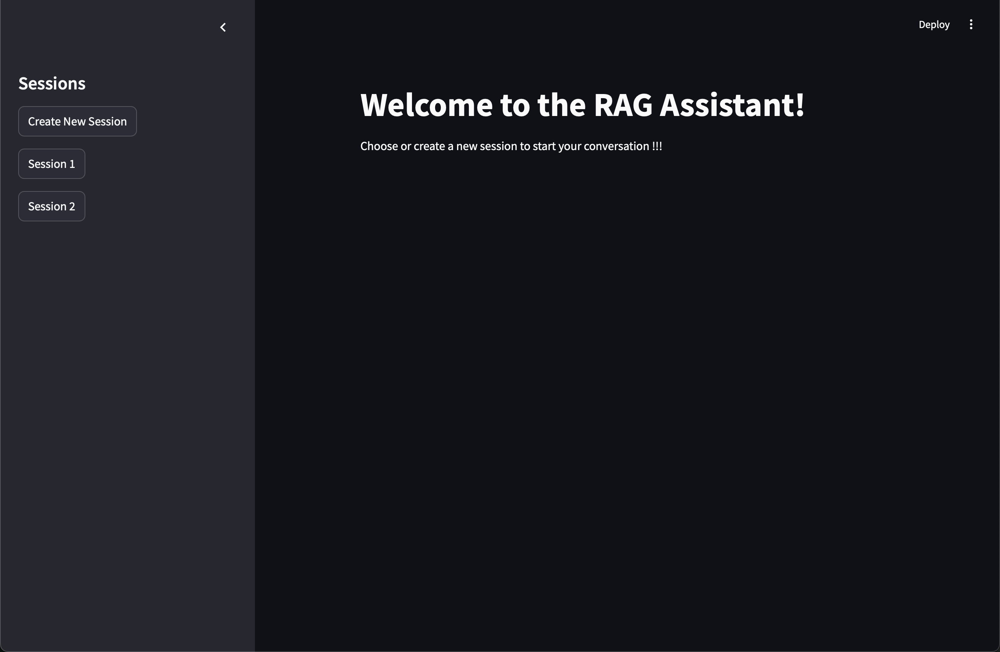

# Multimodal RAG with conversational memory 

This project is designed to build a Multimodal RAG system. To get started, follow the steps below to set up the environment and run the application using `Docker`.

## Prerequisites

Before you start, ensure that you have `Docker` installed on your machine.

### 1. Install Docker

- If you don't have `Docker` installed, download and install `Docker Desktop` from [here](https://www.docker.com/products/docker-desktop).
- Follow the installation instructions for your operating system.

## Setup and Running the Application

Once `Docker` is installed and running, follow these steps to build and run the containers.

### 2. Clone this repository
```bash
git clone https://github.com/baeGil/Multimodal-RAG.git
```

### 3. Provide `.env` file and `data` folder
Create a `.env` file inside the root directory of the project, following the format below

```shell
GOOGLE_API_KEY=YOUR_GOOGLE_API_KEY
QDRANT_API_KEY=YOUR_QDRANT_API_KEY
QDRANT_URL=YOUR_QDRANT_URL
HOST_NAME="postgres"
PORT=5432
USERNAME=YOUR_POSTGRES_USERNAME
PASSWORD=YOUR_POSTGRES_PASSWORD
DB_NAME=YOUR_DB_NAME (multimodal_rag is suggested)
```
Go to backend folder and create an empty folder name `data` if it not exists
### 4. Build the Docker Compose

Navigate to the root directory of the project and run the following command to build the Docker containers:
```bash
docker-compose build --no-cache
```
Then run the following command to start all the containers
```bash
docker-compose up -d
```
You can now view your Streamlit app in your browser by clicking this [url](http://localhost:8501)


## Technologies Used

This project leverages the following technologies:

### **Gemini**
- Gemini 1.5 Flash free tier: fast and flexible performance on many tasks (retriever, summary)
- [Gemini](https://ai.google.dev/gemini-api/docs/models/gemini?hl=vi)

### **FastAPI**
- FastAPI is used as the backend framework for creating APIs. It provides high performance and easy-to-use features for building RESTful APIs.
- [FastAPI Documentation](https://fastapi.tiangolo.com/)

### **Qdrant**
- Qdrant is used as the vector store for efficient retrieval in the Retrieval-Augmented Generation (RAG) system.
- [Qdrant Documentation](https://qdrant.tech/)

### **Streamlit**
- Streamlit is used for building the frontend of the application, allowing the user to interact with the chatbot easily through a web interface.
- [Streamlit Documentation](https://docs.streamlit.io/)

### **Redis**
- Redis is used for caching chat history and improving the system's performance by storing session-specific data.
- [Redis Documentation](https://redis.io/)

### **PostgreSQL**
- PostgreSQL is used for storing chat history and other metadata.
- [PostgreSQL Documentation](https://www.postgresql.org/)

### **Docker**
- Docker is used for containerizing the application, ensuring that it runs consistently across different environments. It simplifies deployment by using containers to package the application and its dependencies.
- [Docker Documentation](https://docs.docker.com/)

## Acknowledgements

A special thanks to the following repositories for their contributions to the success of this project:

- [Multi-modal RAG by LangChain](https://github.com/langchain-ai/langchain/blob/master/cookbook/Multi_modal_RAG.ipynb)
- [Local Multimodal by MnMTech](https://github.com/MnMTech-hub/tutorials/blob/master/LM-Studio/Local-Multimodal.ipynb)

These repositories provided valuable insights and resources that were integral in the development of this project.